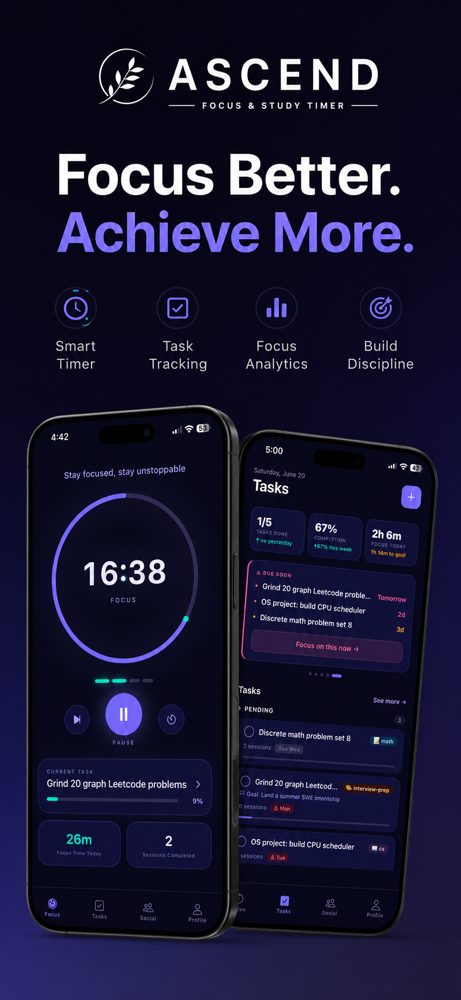
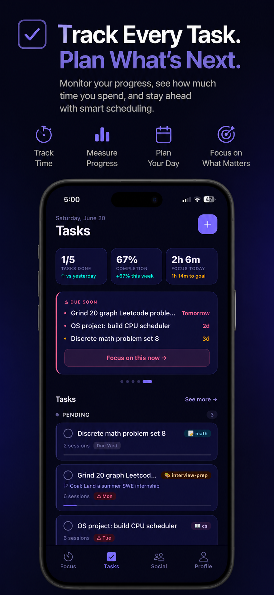
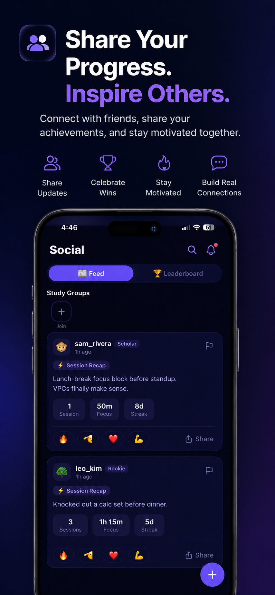

# Ascend

A focus and accountability app on the iOS App Store: timed focus sessions, tasks and habits, goals that track themselves, achievements, and a social layer with follows, groups, and leaderboards. A TypeScript/Express API on PostgreSQL, deployed on Railway, and a React Native / Expo client.

| Focus | Tasks | Social |
|:---:|:---:|:---:|
|  |  |  |

**Download:** [Ascend on the App Store](https://apps.apple.com/us/app/ascend-productivity-timer/id6782227765) (iOS)

## What it does

- **Focus timer** — Pomodoro and stopwatch modes with configurable focus/break lengths. Session completion is validated server-side: you can't credit more time than was planned, can't backdate more than 24 hours, and duplicate submissions are rejected via a client-generated session id.
- **Tasks and habits** — full CRUD with priority, tags, due dates, and notes. A task marked recurring becomes a template that spawns daily instances and tracks its own streak, longest streak, and lifetime focus time.
- **Goals** — progress is computed live on every read from the completed tasks and logged sessions the goal tracks. Goals auto-complete and notify exactly once when they cross 100%. Deadlines are stored as calendar days, not timestamps, so they don't drift across timezones.
- **Gamification** — XP from sessions, tasks (scaled by priority), and goals; five rank tiers (Rookie → Steady → Elite → Legend → Champion); 31 seeded achievements across five categories, with progress-toward-unlock exposed to the client.
- **Social** — follows, an activity feed, posts with reactions, study groups, and a focus leaderboard scoped to everyone, the people you follow, or a single group, over all time or the current month. Blocking and reporting are implemented.
- **Notifications** — Expo push pipeline with dead-token cleanup and four user-controllable preference categories (sessions, friends, goals, achievements).
- **Calendar** — merges tasks, habit instances, goal deadlines, and notes by date; optional Google Calendar sync via OAuth.
- **Analytics** — daily and weekly time series, a year heatmap, most-productive hour, average session length, completion rate, and planned-vs-actual estimation accuracy per task.

## Architecture

```
mobile/   React Native 0.86 + Expo SDK 57, Expo Router (file-based), Zustand, Reanimated,
          socket.io-client, expo-notifications, expo-secure-store
   │  HTTPS (REST, JSON)  +  WebSocket (Socket.IO: /timer, /social)
   ▼
backend/  Node + Express + TypeScript (strict)
          ├─ middleware/   JWT auth (access + refresh tokens), event bus
          ├─ modules/      auth · timer · tasks · taskgoals · achievements ·
          │                social · notifications · calendar · timereport
          ├─ lib/          domain logic: XP, rank, streaks, recurrence, goal progress,
          │                session attribution, time reports, Google Calendar, secret box
          └─ prisma/       schema (20 models), 8 versioned migrations, seed scripts
   │
   ▼
PostgreSQL on Railway
```

**Backend choices worth knowing about**

- **Auth:** JWT access tokens with rotating refresh tokens, bcrypt password hashing, password-reset tokens, terms-acceptance gate. Account deletion hands off owned study groups and cleans up block/report records instead of orphaning them.
- **Hardening:** Zod validation on every request body, Helmet security headers, CORS allowlist, `express-rate-limit` on auth routes, `morgan` request logging. Third-party OAuth tokens are encrypted at rest.
- **Real-time:** two Socket.IO namespaces — `/timer` for live session state across devices, `/social` for feed and cheer events.
- **Data model:** 20 Prisma models (User, Session, Task, TaskGoal, Achievement, FeedEvent, StudyGroup, Note, ExternalCalendarConnection, PostReport, UserBlock, …) evolved through 8 versioned migrations, including a perf-index migration and a moderation migration added for App Store review requirements.
- **Deployment:** Railway with a `/health` healthcheck, `prisma db push` as a pre-deploy step, and two long-lived branches (`staging` → staging environment, `main` → production). Nothing merges to `main` without a staging pass.

## Testing

Tests are split into two Vitest projects so the fast suite stays fast:

| Project | What it covers | Count |
|---|---|---|
| `unit` (backend) | pure domain logic in `lib/` — XP curve, rank drift, recurrence, goal progress, session credit, local-date math, secret box | 17 files |
| `integration` (backend) | every route, run against a **real Postgres test database** (no mocks): success path plus at least one failure path (invalid input, unauthorized, not found) | 26 files |
| mobile | stores, hooks, and components | 23 files |

House rule: a new or changed route is not done until its integration test exists and passes.

```bash
cd backend
npm test                  # unit
npm run test:integration  # needs a local test DATABASE_URL, see .env.test.example
npm run test:all
npm run lint && npm run typecheck
```

## Running locally

**Prerequisites:** Node 20+, PostgreSQL (local or Docker), Expo Go or a dev-client build for the mobile app.

```bash
# backend
cd backend
cp .env.example .env            # DATABASE_URL, JWT secrets, optional Google OAuth + email
npm install                     # runs prisma generate
npm run db:push                 # apply schema.prisma to your database
npm run db:seed                 # achievements catalogue
npm run dev                     # http://localhost:3001, healthcheck at /health

# mobile
cd ../mobile
cp .env.example .env            # API + WebSocket base URLs
npm install
npm run dev                     # expo start --dev-client
```

Schema is applied with `prisma db push`, not `migrate deploy` — the committed
migrations are history, and `schema.prisma` is the source of truth.

## Project layout

```
backend/
  prisma/           schema.prisma, migrations/, seed.ts
  src/
    config.ts       env parsing (fails fast on missing or placeholder values)
    index.ts        Express app, Socket.IO server, route mounting
    middleware/     auth.ts (JWT), eventBus.ts
    modules/        one folder per domain: routes.ts + handlers + *.integration.test.ts
    lib/            domain logic + unit tests
    test/           env.ts, factories.ts (integration test helpers)
mobile/
  app/              Expo Router screens: (auth)/, (tabs)/, calendar/, group/, user/
  components/ hooks/ lib/ services/ stores/
docs/               architecture notes, plans, design docs
```

## Status

Live on the App Store (v1.0.2); mobile client at 2.0.0 in development. See `TODOS.md` for what's next (admin moderation panel, adaptive session planning).

## License

MIT — see `LICENSE`.

---

Built by [Syed Rahman](https://github.com/Hafeezrahman735) · [LinkedIn](https://linkedin.com/in/hafeezrahman735) · [Portfolio](https://hafeezrahman735.github.io/)
